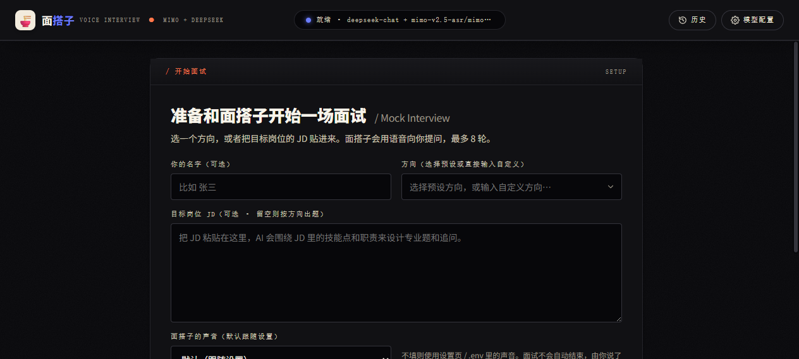
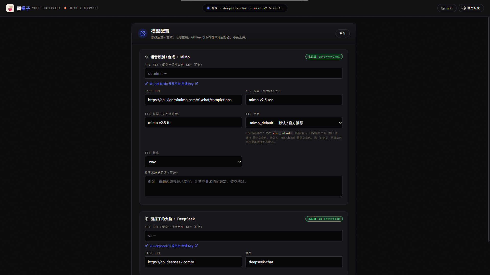
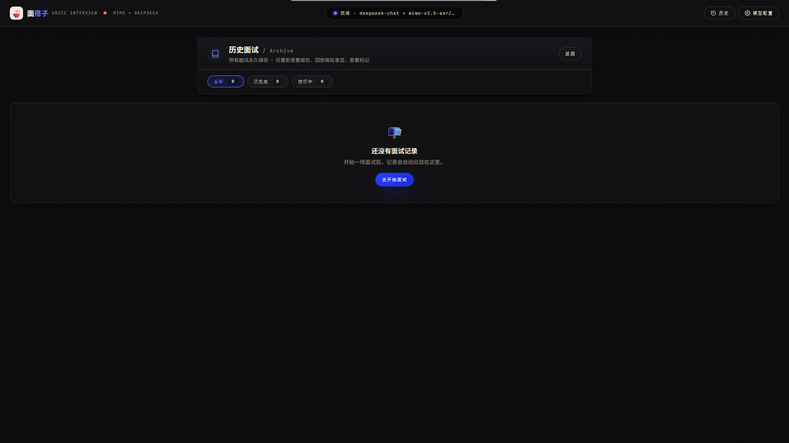

# 🍜 面搭子 · 你的语音模拟面试搭子

[](https://github.com/zkassing/miandazi) [](./LICENSE) [](https://nodejs.org) [](https://mimo.mi.com) [](https://vuejs.org)



> 一个住在浏览器里的面试陪练，**随时在线、随时开练**。
> 你只用开口说，它就会用心听、认真想、温柔问，再给你一份不灌鸡汤的复盘报告。
> 不必约时间、不必找朋友、不必害怕尴尬 —— 面搭子，永远在线等你。

---

> 基于浏览器麦克风 + [Xiaomi MiMo-V2.5-ASR / TTS](https://mimo.mi.com) + [DeepSeek](https://platform.deepseek.com) 的一对一模拟面试 Web 应用。
> 候选人用语音回答，AI 面试官也用语音提问；多轮对话结束后自动生成结构化评估报告。

## 👋 你好，我是面搭子

我叫 **面搭子**，顾名思义，就是陪你这块「面」试的 **搭子**。🧉

我不是一个冷冰冰的题库，也不是一个只会打分的 AI。

我更像你身边那个**已经拿到心仪 offer 的好朋友** —— 懂得在你最焦虑的时候，抛一个刚刚好够得着的问题；也懂得在你答得卡壳时，换个角度帮你把思路捋顺。

你只管说，剩下的交给我：

- 🎤 **你说我听** —— 浏览器麦克风一开，我就开始记录你说的每一个字，连你停顿的几秒、语气里的犹豫，我都会认真对待。
- 🧠 **我想我问** —— 你说完，我会安静想一会儿，然后用一个**真人会问的问题**接住你，而不是甩一长段机器话术。
- 📝 **完事咱复盘** —— 聊完几轮，我会给你一份**像朋友写的复盘**：哪里答得好、哪里可以更好、下次怎么说会更稳。
- 🕊 **没人在意你紧张** —— 说错了没人笑话你，说得短我也不嫌弃，说得好我会真心地「嗯，不错」。

面试这件事，从来不该是一个人的战斗。
有了我，你就**有搭子了**。🍵

---

## ✨ 我能陪你做什么

- 🎤 **全屏沉浸式 UI**：中央一个会"说话/思考/聆听"状态切换的语音球，候选人专注作答。
- 🤖 **AI 面试官**：用 DeepSeek (`deepseek-v4-flash`) 编排，结构化 JSON 输出每一轮的提问、追问、结束信号。
- 🪄 **可定制方向**：内置 10 个方向（前端/后端/算法/产品/运维 等），或粘贴目标 JD 让 AI 围绕 JD 出题。
- 🔁 **多轮对话**：默认 5 轮（可设 3/5/8），由 DeepSeek 自行决定何时结束（候选人主动说"结束"也会立刻收尾）。
- 📝 **逐轮点评 + 综合报告**：6 维度雷达图（逻辑 / 表达 / 深度 / 匹配 / 应变 / 综合），每题都有"建议回答"示范、3 条改进建议、最终结论。
- ⬇️ **报告下载**：Markdown 与纯文本两种格式。
- 📒 **历史记录（SQLite）**：所有面试永久保存到 `./data/app.db` + `./data/audio/<sessionId>_r<n>.wav`。顶栏「历史」入口可随时查看 / 回放 / 删除。
- 🔖 **面试标记**：面试中可随时点「🔖 标记」按钮记录重要时刻，标记会贴到报告里对应轮次的下方。
- 🔐 **API Key 仅在服务端**：浏览器侧不直连任何第三方 API。

## 🏗 架构

```
浏览器 (Vue 3 SPA @ 5173)
  │
  │  Vite dev server 代理 /api/* → Fastify
  │
  ▼
Node + Fastify (src/，TypeScript, @ 5174)
  ├─ MiMo ASR (mimo-v2.5-asr)         ← 语音 → 文本
  ├─ DeepSeek (deepseek-v4-flash)     ← 文本 → 下一题 JSON
  └─ MiMo TTS (mimo-v2.5-tts)         ← 文本 → 语音 base64
  │
  ▼
浏览器  ← { question, transcript, tts.audioBase64, endInterview }
```

每场面试在服务端内存里维护一个 session（默认 30 分钟 TTL），保存所有 turn 直到结束生成报告。

## 📁 目录结构

```
语音转文字/
├── frontend/                 # Vite + Vue 3 + TS 单页应用
│   ├── src/
│   │   ├── views/            # 路由页面：Home / Interview / Report / Settings / History
│   │   ├── components/       # 共享组件：TopBar / Orb / SampleAnswerModal / TopicChip ...
│   │   ├── composables/      # useRecorder (录音+静音检测+波形) / useAudio / useToast
│   │   ├── stores/           # Pinia: interview / health / settings
│   │   ├── api/              # axios 客户端 + 11 个接口封装
│   │   ├── router/           # Vue Router 4 + 路由守卫
│   │   ├── styles/           # 拆出的 CSS 变量层 (variables / base / components)
│   │   ├── types/            # 与后端共享的 TS 类型
│   │   └── main.ts
│   ├── package.json
│   ├── tsconfig.json / tsconfig.node.json
│   ├── vite.config.ts        # /api → 5174 代理
│   └── index.html
├── src/                      # Fastify 后端 (TypeScript, Node 原生运行)
│   ├── server.ts             # API 入口（包含 /api/history/* + /api/audio/*）
│   ├── config.ts             # .env 配置
│   ├── modelSettings.ts      # 运行时模型设置 + .model-settings.json 持久化
│   ├── mimoClient.ts         # MiMo STT + TTS
│   ├── deepseekClient.ts     # DeepSeek chat
│   ├── interviewPrompts.ts   # 面试官 system prompt
│   ├── interviewOrchestrator.ts  # 单轮流程编排 + 镜像到 SQLite
│   ├── sessionStore.ts       # 内存会话存储 + TTL（进行中的会话用这个）
│   └── db.ts                 # SQLite (内置 node:sqlite) + DAO: sessions / turns / markers
├── data/                     # 运行时生成（已 gitignore）
│   ├── app.db                # SQLite 数据库
│   └── audio/                # 每轮录音 WAV，命名 <sessionId>_r<round>.wav
├── scripts/
│   ├── launch.mjs            # 一键启动：检查 Key + 提示输入 + 启动服务 + 开浏览器
│   ├── dev.mjs               # 并行启动 API + Web（彩色日志）
│   └── smoke-*.mjs
├── start.bat                 # Windows 一键启动（双击运行）
├── start.sh                  # macOS / Linux 一键启动（./start.sh）
├── package.json
├── .env.example
└── README.md
```

## 🚀 快速开始

### 0. 一键启动（推荐）✨

只需要 Node.js ≥ 22.13（需要 `--experimental-strip-types`；SQLite 用内置 `node:sqlite`，无需编译）。依赖、`.env`、Key 都会自动处理：

**Windows 用户**：双击项目根目录的 `start.bat` 即可启动。

**macOS / Linux 用户**：在终端运行 `./start.sh`（或双击 `start.sh`，如果资源管理器允许运行脚本）。

**或者用 npm 脚本**（全平台通用）：

```bash
npm run launch
```

`start.bat` / `start.sh` / `npm run launch` 内部都会调用同一个 `scripts/launch.mjs`，行为完全一致。

**脚本会做的事：**
1. 检查 Node 版本
2. `node_modules` 缺失时自动 `npm install`
3. 检查 `.env` 和 `.model-settings.json` 里的 **MiMo** / **DeepSeek** Key
4. **缺失则交互式提示输入**（键入时掩码回显），输入后写入 `.env`，保留所有原有注释和字段
5. 启动后端（5174）+ Vite（5173）
6. 后端 `/api/health` 返回 200 后自动打开浏览器到 `http://localhost:5173`
7. Ctrl-C 优雅停止（服务关闭后窗口才关闭，不会一闪而过）

**参数：**
```bash
# npm
npm run launch -- --no-open    # 启动后不打开浏览器（适合远程开发）
npm run launch -- --reset      # 强制重新输入 Key（即便 .env 已有）
npm run launch -- --port 5180  # 自定义后端端口

# Windows 脚本（双击运行时不带参数）
start.bat --no-open
start.bat --reset

# macOS / Linux
./start.sh --no-open
./start.sh --reset
```

**首次使用体验：**
```
  🍜 面搭子 · 一键启动
  项目根目录: C:\Users\kassi\Desktop\语音转文字

[launch] 检测到 Key 缺失: MiMo + DeepSeek

┌───────────────────────────┐
│  🗝  需要配置 2 个 API Key│
│                           │
│  接下来会依次询问，按提示填写即可。│
│  Ctrl-C 随时取消。输入 ?  查看帮助。│
└───────────────────────────┘

┌──────────────────────────────────────────────┐
│  Step 1 / 2  ·  Xiaomi MiMo API Key         │
│                                              │
│   用途   语音转文字 (STT) + 文字转语音 (TTS)  │
│   申请   https://platform.xiaomimimo.com ... │
│   格式   sk-mimo-xxxxxxxxxx... (约 48-56 字符)│
└──────────────────────────────────────────────┘

  需要我帮你打开浏览器到申请页吗？ [Y/n]: Y
  MiMo Key> ********************************************  ← 输入时掩码
  ✓ 已收到: sk-m***efgh (52 字符)

┌──────────────────────────────────────────────┐
│  Step 2 / 2  ·  DeepSeek API Key             │
│  ... 同样引导 ...                             │
└──────────────────────────────────────────────┘

┌────────────────────────────┐
│  ✅  全部完成               │
│  已写入 C:\...\语音转文字\.env│
│  下次启动 npm run launch 会自动跳过询问。│
└────────────────────────────┘

[launch] 启动后端 (port 5174) + 前端 (port 5173)...
[launch] 后端就绪: http://localhost:5174/api/health
[launch] Key 状态: MiMo ✓  DeepSeek ✓
[launch] 正在打开浏览器...
```

**每个 Key 都有：**
- 📦 **边框分块** 的引导卡片（用途 / 申请地址 / 格式要求）
- 🌐 **一键打开浏览器** 跳到申请页（Y/n 可选）
- 🔍 **实时格式校验**（太短 / 缺少 `sk-` 前缀会提示重输）
- ❓ **输入 `?` 查看详细帮助**（5 步走流程）
- 🚫 **空输入不能跳过**（严格模式，防止漏配）

**输入交互细节：**
- 逐字输入：每打一个字符显示一个 `*`（标准密码风格）
- **粘贴 Key**：一次性提示 `[paste 50 chars]`，不会以 50 个 `*` 刷屏
- 管道输入（CI）：不重复回显，直接读取（管道本就没反馈）
- Backspace / 方向键：readline 原生处理，光标正常移动
- 输入后：显示 `✓ 已收到: sk-m***efgh (52 字符)` 的脱敏预览

> 如果不想让脚本管理 Key，也可以直接走下面的手动流程。脚本只会在 Key 缺失时才提示，已经配过的用户会完全跳过询问。

### 1. 安装依赖

需要 Node.js ≥ 22.13（我们用 `--experimental-strip-types` 直接跑 .ts；SQLite 走内置 `node:sqlite`，没有原生编译依赖）。

```bash
# 后端依赖（Fastify 等）
npm install

# 前端依赖（Vue / Vite / axios / pinia 等）
npm --prefix frontend install
```

### 2. 配置 API Key

前往两个控制台拿 key：

- **MiMo**：<https://platform.xiaomimimo.com/console/api-keys>
- **DeepSeek**：<https://platform.deepseek.com/api_keys>

```bash
cp .env.example .env
# 编辑 .env，填入：
# MIMO_API_KEY=sk-mimo-...
# DEEPSEEK_API_KEY=sk-...
```

> 也可以不改 `.env`，直接访问 `http://localhost:5173/settings` 在网页里配 Key / Base URL / 模型名 / TTS 声音，保存后立即生效、无需重启。配置会持久化到项目根目录 `.model-settings.json`（已 gitignore）。



### 3. 启动

**两种模式：**

#### A) 一键启动（同时跑后端 + 前端 dev server）

```bash
npm run dev
```

打开 <http://localhost:5173>。
- 前端 dev server 在 **5173**
- 后端 API 在 **5174**，Vite 已自动代理 `/api/*` 到 5174

#### B) 分别启动

```bash
# 终端 1：后端（5174）
npm run dev:api

# 终端 2：前端（5173）
npm run dev:web
```

#### C) 生产构建

```bash
npm run build:web      # 产物在 frontend/dist/
npm start              # 仅启动后端 API（5174）
# 然后用 nginx/Caddy 把 frontend/dist 静态托管，并把 /api 代理到 5174
```

## 🧩 API 协议

| 路径 | 方法 | 说明 |
|---|---|---|
| `/api/health` | GET | 健康检查（MiMo + Deepseek key 状态） |
| `/api/settings` | GET | 当前模型配置（key 已掩码）+ 各平台 Key 申请网址 |
| `/api/settings` | POST | 更新模型配置（立即生效，持久化到 `.model-settings.json`） |
| `/api/settings/reset` | POST | 清空运行时覆盖，恢复 `.env` 默认值 |
| `/api/settings/test` | POST | 连接测试（可带表单里未保存的候选配置） |
| `/api/transcribe` | POST | 单独的 MiMo ASR 入口（保留原 STT 工具功能） |
| `/api/interview/start` | POST | 开始一场面试 |
| `/api/interview/turn` | POST | 提交一个回答的音频，返回下一题 + TTS |
| `/api/interview/report` | POST | 生成结构化报告（首次后缓存） |
| `/api/interview/end` | POST | 候选人主动 ⏹ 时把 session 标记为 finished |
| `/api/interview/session/:id` | GET | 会话快照（用于报告页兜底） |
| `/api/interview/session/:id` | DELETE | 丢弃会话 |
| `/api/history` | GET | 列出所有面试（SQLite 持久化） |
| `/api/history/:id` | GET | 某场面试的完整详情：meta + 轮次 + 标记 + 缓存报告 |
| `/api/history/:id` | DELETE | 彻底删除一场面试 + 全部录音文件 |
| `/api/history/:id/marker` | POST | 在某轮打一个标记，body `{ round: number }` |
| `/api/audio/:turnId` | GET | 流式返回某轮的录音 WAV |

协议细节、`/api/interview/*` 的请求/响应体、报告 shape 与原版一致，详见 git 历史。

## 🗺 前端路由

| 路径 | 视图 | 说明 |
|---|---|---|
| `/` | `HomeView` | 选方向 / 贴 JD / 开始面试 |
| `/interview` | `InterviewView` | 沉浸式面试：中央语音球 + 波形 + 录音 + 5s 提示卡 + 🔖 标记按钮 |
| `/report` | `ReportView` | 当前面试的评估报告，含雷达图 + 逐轮点评 + 录音回放 + 标记 |
| `/history` | `HistoryView` | 历史面试列表（方向 / 时间 / 评分） |
| `/history/:id` | `ReportView` | 历史面试的报告（只读，与进行中报告同视图） |
| `/settings` | `SettingsView` | 模型配置（MiMo / Deepseek Key / Base URL / 模型名） |

`/interview` 和 `/report` 都带守卫：没有 sessionId 时跳回首页。`/history/:id` 直接从 SQLite 读，不需要进行中的 session。



## 🛠 常见问题

**Q: TTS 没有声音 / 报 `MiMo TTS did not return audio data`？**
A: 与原版一致：
- 请求体里 **不要包含 `stream` 字段**（即使设为 false），否则会报 `Invalid JSON in request body`。
- `messages[0].role` 必须是 `assistant`（不是 user）—— TTS 是「读出来」模型提供的文本。
- `audio.voice` 必须是 MiMo 支持的声音之一。
- 失败时前端会自动 fallback：把 `question` 文本显示出来，用户可以手动点「重听题目」。在控制台能看到具体原因。

**Q: 上传 mp3 给 STT 时报 `Param Incorrect`？**
A: STT 单次请求的 `input_audio.data` 上限是 10 MB。短回答（< 几分钟）不会触发；如果会，参考旧版 `mp3Splitter.js` 在浏览器里切片再上传。

**Q: DeepSeek 没在第 N 轮结束？**
A: 把 `DEEPSEEK_MAX_ROUNDS` 调大；或在最后一轮里点 ⏹ 手动结束。

**Q: 想换 ASR / TTS 到其它厂商？**
A: 改 `src/mimoClient.ts` 即可，前端 / 编排代码不变（因为都是 buffer in / base64 out）。

**Q: 前端跑得起来吗？**
A:
```bash
cd frontend && npm install
cd .. && npm run dev
# 浏览器打开 http://localhost:5173
```

**Q: 生产部署怎么搞？**
A: `npm run build:web` 生成 `frontend/dist/`，然后用任意静态服务器托管 + 反代 `/api` 到 5174 的 Fastify。

## 📜 许可

本仓库代码 MIT。MiMo / DeepSeek 模型与 API 服务条款见各自官网。
